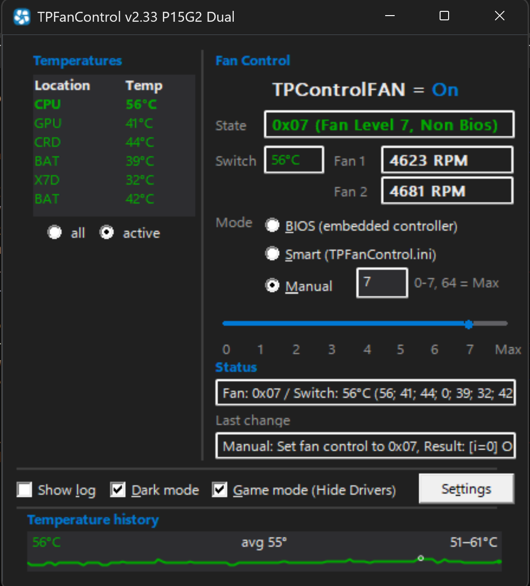

# TPFanControl — P15 Gen2 Dual-Fan build

[](https://github.com/indigoidk/TPFanCtrl2_P15G2/actions/workflows/build.yml)
[](https://github.com/indigoidk/TPFanCtrl2_P15G2/releases/latest)



A Windows fan-control utility for Lenovo ThinkPads. It reads the embedded
controller (EC) for temperatures and fan speeds and lets you run the fan in
**BIOS (automatic)**, **Smart (temperature-curve)**, or **Manual** mode.

## Download

**➜ [Download the latest release](https://github.com/indigoidk/TPFanCtrl2_P15G2/releases/latest)**

Grab the `TPFanControl-P15G2-*.zip`, unzip it anywhere, and run
`TPFanControl.exe` **as Administrator**. The zip includes a pre-tuned
`TPFanControl.ini` (P15 Gen2 fan curve).

> - Windows SmartScreen may warn about the unsigned exe → **More info → Run anyway**.
> - You also need the **TVicPort** driver installed on the machine (see
>   [Requirements](#requirements)); it is not redistributed here for license
>   reasons —
>   [download it free from EnTech Taiwan](http://www.entechtaiwan.com/dev/download/ccount/click.php?id=6).

This is a fork of the classic *TPFanControl / TPFanCtrl2* tailored for the
**ThinkPad P15 Gen2 (dual fan)**, with a number of additional features (see
below). Code version string: `2.33 P15G2 Dual`.

> ⚠️ **Use at your own risk.** This tool writes directly to the embedded
> controller. Misconfiguring the fan curve can let the machine run hot. The
> app falls back to BIOS fan control on exit, on lid close, and after repeated
> EC read errors.

## Features

- Dual-fan (fan1/fan2) read-out and control for the P15 Gen2.
- **Smart mode** with per-level hysteresis and two switchable profiles (SM1/SM2).
- **Manual mode** with a fan-speed slider (0–7, 64 = max, 128 = hand back to BIOS).
- **Temperature history graph** (in-window sparkline) with current / average /
  min–max readout; right-click to clear.
- **Tray temperature icon** showing the current max temperature, color-coded by
  the same thresholds as the in-app temperature list (green → amber → orange →
  red; gray in BIOS mode).
- **In-app Settings dialog** (writes `TPFanControl.ini`) with live Apply,
  including editable icon color thresholds, poll interval, and a graph toggle.
- **Dark mode**, per-monitor **DPI** scaling, and a resizable window.
- **Game Mode** — temporarily hides the TVicPort kernel-driver files so
  anti-cheat (e.g. Riot Vanguard) doesn't flag them; restored automatically on
  exit/shutdown.
- Optional logging to `TPFanControl.log` and CSV; °C/°F display.

## Requirements

- Windows 10/11 (x86 / Win32 build).
- **Administrator privileges** — required to talk to the embedded controller.
- The **TVicPort** kernel driver (port-I/O access) —
  **[download: TVicPort (fully-functional freeware)](http://www.entechtaiwan.com/dev/download/ccount/click.php?id=6)**
  from EnTech Taiwan, then run its installer. `TVicPort.lib` is included in this
  repo so the project builds from a clean clone; the driver itself must be
  installed on the target machine.
- A supported **Lenovo ThinkPad** (EC layout matches; defaults tuned for P15 Gen2).

## Building

Open `fancontrol.sln` in Visual Studio (2019/2022) and build **Release | Win32**,
or from a Developer prompt:

```
msbuild fancontrol.sln /m /p:Configuration=Release /p:Platform=Win32
```

The output is `Release\TPFanControl.exe`. Every push and pull request is also
built by GitHub Actions (`.github/workflows/build.yml`), which uploads the exe
as a build artifact.

### Tests

The hardware-independent fan-decision logic (temperature biasing and the Smart
fan-curve algorithm) is factored into `fanlogic.h` and covered by standalone unit
tests that need no driver or hardware. Run them from a Developer prompt:

```
powershell -ExecutionPolicy Bypass -File tests\run_tests.ps1
```

`FANCONTROL::BiasedTemp()` and `FANCONTROL::SmartControl()` delegate to
`fanlogic.h`, so the tests exercise the same code the app runs.

Pushing a version tag publishes a downloadable **Release** with the packaged
zip attached (`.github/workflows/release.yml`):

```
git tag v2.33.1
git push origin v2.33.1
```

## Configuration

Settings live in `TPFanControl.ini` (next to the exe). The file is heavily
commented; the in-app **Settings** dialog edits the common options for you.
Highlights:

- `Active` — start mode (0 read-only, 1 enable, 2 Smart, 3 Manual).
- `Level=temp fan hystUp hystDown` — the Smart-mode curve.
- `IconLevels=warm hot critical` — tray-icon / list / graph color thresholds.
- `Cycle` — poll interval in seconds (also the graph sample rate).
- Hotkeys (`Ctrl+Shift+B/S/M/1/2`) for switching modes.

## Changelog

### v2.33.7

GUI experience pass (no change to the fan-control engine; still pure Win32, no
added runtime dependencies).

- **In-app Smart fan-curve editor.** The `Level=` / `Level2=` curves no longer
  require hand-editing the ini. A new **Edit Fan Curve…** dialog (tray menu, and
  a **Fan curve…** button in Settings) edits both Smart profiles in a grid of
  Temp / Fan / Hyst+ / Hyst- rows. Edits are validated, sorted, applied live
  (hysteresis reset), and written back to the ini — shown/edited in your display
  unit and converted back to Fahrenheit on save so the auto-detect round-trips.
- **Field tooltips.** Hovering the terse main-window controls (State, Switch,
  Fan 1/2, the Mode radios, the manual level box and slider, the temperature
  list and history graph, Game Mode) now explains what each one means.
- **Window-position memory.** The main window reopens where you last left it
  (saved to a `WindowPos=` ini line, and only restored if it still lands on a
  connected monitor; size is remembered for the resizable full window).

### v2.33.6

Stability and correctness pass (largely internal; no UI changes).

- **Temperatures / fan decisions:** sensor offsets (`ShowBiasedTemps`) are now
  applied once and consistently, so the value driving Smart-mode fan levels
  matches the temperature list. Previously the offset was applied twice, making
  fan decisions run cooler than what was shown; the hysteresis window
  (`hystMin`/`hystMax`) is now honored everywhere.
- **Embedded controller reads:** wait for the EC output buffer before reading, so
  a stale byte can no longer latch and drive a wrong fan decision.
- **Shutdown / restart:** BIOS fan control is now restored **synchronously** on
  Windows shutdown instead of via a deferred message that could be skipped if the
  process was terminated first.
- **Service mode:** detection no longer relies on a brittle mutex/thread side
  effect (and no longer leaks a handle); the service reports `STOPPED` when its
  worker exits or fails to open the EC port, can no longer hang on stop, and
  quotes its executable path on install (spaces-in-path / unquoted-service-path
  fix).
- **Game Mode:** a partially-completed driver hide now rolls back, so it can't
  leave the system with only one of the two TVic drivers renamed.
- **Config safety:** `TPFanControl.ini` is replaced atomically (a failed save can
  no longer lose it); `IgnoreSensors` matches case-insensitively as the comments
  document; oversized fan-curve (`level=` / `level2=`) tables can no longer
  overflow.
- **Robustness / build:** removed a too-small linker stack reserve that left
  Release builds stack-fragile; switched the boot-delay timer to `GetTickCount64`
  (no ~49-day wrap); bounds-guarded the temperature-list cache signature;
  hardened the service error dialog against a null dereference; and bumped the
  binary's `VERSIONINFO` (`FILEVERSION`/`PRODUCTVERSION`) to `2.33.6.0` so the
  executable's file properties reflect the release (was frozen at `1.0.0.63`).

### v2.33.5

- Added a **Settings…** button to the main window (previously only reachable
  from the tray menu).
- Settings dialog gained a **Behavior** section exposing previously ini-only
  flags, all persisted to `TPFanControl.ini`:
  - Color tray icon by fan speed (else by temperature) — `IconColorFan`
  - Apply sensor offsets to displayed temperatures — `ShowBiasedTemps`
  - Treat fan level 64 as normal (not maximum) — `Lev64Norm`
  - Skip external / secondary temp sensors — `NoExtSensor`
- Internal: worker-thread stack raised to 256 KB (Trace headroom); CSV log
  rotation now uses Win32 file calls instead of spawning `cmd.exe`.

### v2.33.4

- Tray icon now always shows thermal state: with `IconColorFan=1` the fan-speed
  green shades apply only while the temperature is in the safe band — once a
  warm/hot/critical `IconLevels` threshold is crossed the icon turns
  amber/orange/red regardless of fan RPM. (Previously `IconColorFan=1` pinned
  the icon to a green shade by RPM, so it never reflected temperature.)
- Lowered the shipped default `IconLevels` from `65 75 85` to `50 65 78` so a
  fresh install reflects temperature in a typical laptop range. (Existing
  `TPFanControl.ini` files are unchanged.)

### v2.33.3

- Removed the unused named-pipe broadcast (8 pipes were created and written
  every icon cycle with no consumer) — less per-cycle work and complexity.
- Fixed a corrupted `°` character in the tray balloon tooltips.
- Moved the dialog's file-scope scratch globals (`obuf`, `icon`, balloon
  one-shot flags, tooltip buffer) to locals/members — no reentrancy-fragile
  global state.
- CI now builds with the newest toolset installed on the runner instead of a
  pinned version.

### v2.33.2

- Docs: the full changelog is now shown on the project page **and** mirrored
  into the GitHub Release notes automatically.
- Repackaged zip carries the updated README. No functional code changes
  since v2.33.1.

### v2.33.1

**Performance**
- Tray temperature icon no longer rebuilds its GDI bitmap/font/HICON every
  title-timer tick (~2×/sec); it now rebuilds only when the shown value,
  color, or font actually changes.
- Temperature list (RichEdit) is left untouched when nothing visible changed.

**Fixes**
- Game Mode drivers are now restored on Windows **shutdown/logoff**, not only
  on a clean exit; restore path hardened.
- Capped the EC verify-and-retry loop so a failing controller can't freeze the
  UI thread on a fan write (~1.5 s worst case).
- Fixed a GDI double-free, a missing `ReleaseDC`, and dead balloon code; fixed
  `_beginthread` handle handling and stale `hThread` use on close paths.
- `SetHdw` no longer reads an uninitialized value when an EC read fails.
- Profile-switch log no longer appends to a never-reset buffer (garbled text);
  removed an undefined-behavior self-overlapping `sprintf`.
- Config parsing reads via a robust `fgets` loop; in Fahrenheit mode **all 16**
  sensor offsets convert correctly, including the `hystMin/hystMax` bounds.
- Guarded a 1-byte underwrite when the temperature list is empty.

**Added (fork features over upstream TPFanControl)**
- Dual-fan (fan1/fan2) read-out and control for the ThinkPad P15 Gen2.
- Smart mode with two switchable profiles (SM1/SM2) and per-level hysteresis.
- In-window **temperature history graph** (current / average / min–max;
  right-click to clear).
- Temperature-only recolored **tray icon**; color thresholds shared with the
  in-app list and graph.
- In-app **Settings dialog** (writes `TPFanControl.ini`, live Apply).
- **Dark mode**, **DPI awareness** (System/Per-Monitor) with DPI-scaled icons,
  and a resizable window with anchor-based reflow.
- **Game Mode** — hides the TVicPort kernel-driver files from anti-cheat and
  restores them automatically.

**Build / project**
- GitHub Actions CI builds every push/PR; pushing a `vX.Y.Z` tag publishes a
  Release with the packaged zip + exe attached.
- CI builds with the `v143` toolset and the runner's installed Windows SDK,
  while the checked-in project keeps the developer's local target.
- Builds from a clean clone (tracked `TVicPort.lib` + resources); `.rc`
  include and Release `TargetName` fixes; `.gitattributes` line-ending
  normalization.
- Removed the obsolete Bluetooth toggle, dead donate code, and unused assets;
  collapsed repetitive sensor-config parsing and mode-change logging.

## License & credits

The application source is released into the public domain (see
[`LICENSE`](LICENSE)). It builds on the original **TPFanControl** by Rolf
Schädler / Troubadix and the TPFanCtrl2 lineage.

**Third-party:** `TVicPort` (EnTech Taiwan) is *not* covered by this project's
license — it has its own terms. Ensure you are licensed to use/redistribute it.
Download:
[TVicPort (fully-functional freeware)](http://www.entechtaiwan.com/dev/download/ccount/click.php?id=6).
